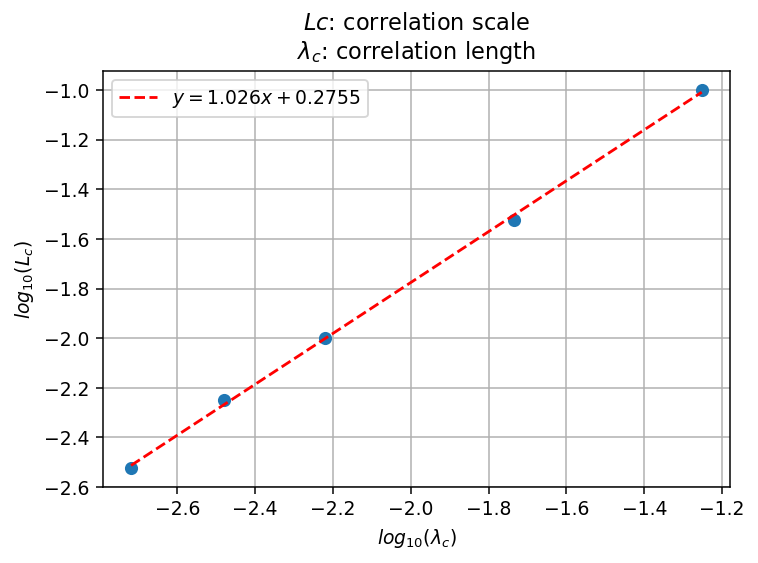

# calc the relation between the `Lc` (correlation scale of the model) and `lambda_c` (correlation length by definition):
we calculate `lambda_c` by fitting an isotropic (averaged on `theta`, where `theta` is the angle of the displacement `$r$` from the z-axis) correlation function `$R(r)$` as a function of the displacements `$r$`.

Finally, we make a plot between the `Lc` parameters of these correlation functions, and the `lambda_c` fitted values (see file `./linfit.png`):



---
## fitted correlation functions `R(r)` (averaged over `th`)

To reproduce this, go as follows.

Generate the correlation functions $R(theta,r)$:
```bash
./test.py -- --bidim -o Rbidim_Lc.0.01.h5 -Lc 0.01 -Nrlz 128 -slab 0.2 2> /dev/null
./test.py -- --bidim -o Rbidim_Lc.0.10.h5 -Lc 0.1 -Nrlz 128 -slab 0.2 2> /dev/null
./test.py -- --bidim -o Rbidim_Lc.0.30.h5 -Lc 0.3 -Nrlz 128 -slab 0.2 2> /dev/null
./test.py -- --bidim -o Rbidim_Lc.1.00.h5 -Lc 1.0 -Nrlz 128 -slab 0.2 2> /dev/null

# NOTE: before using the above, you need to compile some Cython libraries, such as 
# those in /funcs/, /literatura/Bparker/, /src_Bmodel/ by executing:
source activate work  ## para trabajar con la version correcta del compilador Cython.
make clean && make
```

Generate the "isotropized" version of `$R(th,t)$` --> `$R(r)$`, and fit the `lambda_c` value:
```bash
./plot_R.py --pdb -- -i Rbidim_Lc.0.01.h5 -fig ./Rbidim_Lc.0.01.png
./plot_R.py --pdb -- -i Rbidim_Lc.0.10.h5 -fig ./Rbidim_Lc.0.10.png
./plot_R.py --pdb -- -i Rbidim_Lc.0.30.h5 -fig ./Rbidim_Lc.0.30png
./plot_R.py --pdb -- -i Rbidim_Lc.1.00.h5 -fig ./Rbidim_Lc.1.00.png
```

Grab the fitted values `lambda_c` and the scales `L_c` of all the previous files, and fit their relationship:
```bash
./linear_fit.py # generates the ./linfit.png
```

---
## fits along cuts of the `R(r,th)` (along `th=0` and `th=\pi`)

Generate the correlation functions:
```bash
./test.py -- -o Rfunc_Lc.0.30.h5 -Lc 0.30 -Nrlz 256 -slab 0.2 2> /dev/null
./test.py -- -o Rfunc_Lc.0.03.h5 -Lc 0.03 -Nrlz 256 -slab 0.2 2> /dev/null
...

# Then, make an exponential fit && plots:
./fit_Lc.py --pdb -- -i ./Rfunc_Lc.3.00.h5 -fig ./test.png
```


<!--- EOF -->º
